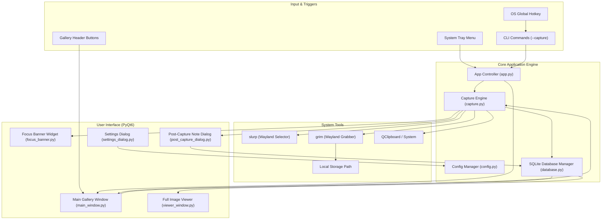

# SnapNotes 📸

> **Desktop Screen Capture, Searchable History & Note Manager for Linux**


**SnapNotes** is a modern, lightweight, feature-rich screen capture and snippet management application built for Linux desktops. It allows you to quickly take screenshots of selected screen regions or target application windows, specify custom storage locations, attach searchable text notes, browse high-resolution gallery histories, and operate seamlessly from your system tray.

---

## 🚀 Features & Menu Choices

### 📥 1. System Tray Menu Choices (Right-click System Tray Icon)

| Menu Choice | Description |
| :--- | :--- |
| **Capture Area** | Click & drag a rubberband box over any region of the screen to capture a snippet. |
| **Focus Target App & Snip** | Displays a top banner allowing you to click any background application (Browser, Terminal, Editor) to bring it to the front before snipping. |
| **Select App Window** | Hover over any open window to highlight its boundaries, and click to snap it directly. |
| **Capture Fullscreen** | Instantly captures your entire desktop display. |
| **Capture Delayed (3s)** | Starts a 3-second countdown timer for capturing open dropdown menus. |
| **Open Gallery & History** | Opens or raises the main SnapNotes history window. |
| **Open Save Folder** | Opens your screenshot save directory in the system file manager (`xdg-open`). |
| **Settings** | Opens the options dialog to customize save paths and preferences. |
| **Quit SnapNotes** | Closes and exits the application. |

---

### 🖥️ 2. Main Window Header Menu Choices

| Button / Control | Description |
| :--- | :--- |
| **Area** *(Primary)* | Trigger interactive region snippet selection. |
| **Focus App** | Bring a target application into front focus before capturing. |
| **App Window** | Select and snap an open application window directly. |
| **Fullscreen** | Capture full active desktop. |
| **3s Delay** | Capture after 3-second timer countdown. |
| **Save Folder** | Open current screenshot storage directory. |
| **Settings** | Modify save path and prompt behavior. |
| **Search Input** | Real-time filter across notes, filenames, and dates. |
| **Sort Dropdown** | Sort history by **Newest First**, **Oldest First**, **Largest Size**, or **Smallest Size**. |

---

### 🖼️ 3. Individual Screenshot Card Actions

| Action | Description |
| :--- | :--- |
| **View** | Opens the **Full-Resolution Viewer** with pan, mouse-wheel zoom (`Fit Screen`, `100% Actual`), and metadata. |
| **Copy** | Copies the screenshot image to the system clipboard. |
| **Edit Note / + Add Note** | Attach or modify searchable text notes attached to the screenshot. |
| **Delete** | Removes the screenshot metadata and deletes the image file from disk after confirmation. |

---

## 📸 Screenshots

| History Gallery View | Full Resolution Viewer & Note Editor |
| :---: | :---: |
|  |  |

---

## 🏗️ Architecture

SnapNotes follows a clean, modular Model-View-Controller (MVC) architecture with persistent SQLite metadata storage and async capture handlers.



---

## 🛠️ Prerequisites & Installation

### 1. Install Dependencies (Debian / Ubuntu / Raspberry Pi OS)

```bash
sudo apt update
sudo apt install -y python3-pyqt6 python3-pil grim slurp
```

### 2. Clone & Setup Repository

```bash
git clone https://github.com/gwarecoder/snapnotes.git
cd snapnotes
```

### 3. Install Executable Launcher

```bash
mkdir -p ~/.local/bin ~/.local/share/applications

# Create wrapper script
cat << 'EOF' > ~/.local/bin/snapnotes
#!/bin/bash
export QT_QPA_PLATFORM=xcb
exec /usr/bin/python3 /home/tomg/snapnotes/main.py "$@"
EOF

chmod +x ~/.local/bin/snapnotes
```

---

## 🖥️ Usage & Command Line Interface

Launch SnapNotes directly from your app menu or terminal:

```bash
# Open Main History Gallery Window
snapnotes

# Start Minimized to System Tray
snapnotes --tray

# Trigger Immediate Area Capture
snapnotes --capture

# Trigger Immediate Fullscreen Capture
snapnotes --fullscreen
```

---

## ⚙️ Configuration & Data Storage

- **Configuration File**: `~/.config/snapnotes/config.json`
- **Database File**: `~/.config/snapnotes/snapnotes.db`
- **Thumbnail Cache**: `~/.cache/snapnotes/thumbnails/`
- **Default Screenshot Directory**: `~/Pictures/Screenshots/`

---

## 📄 License

MIT License. Developed for Linux desktops by [gwarecoder](https://github.com/gwarecoder).
