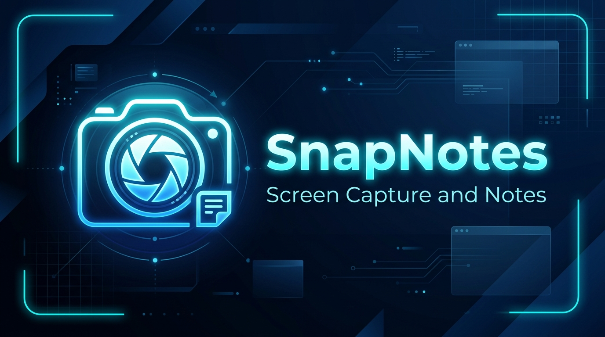
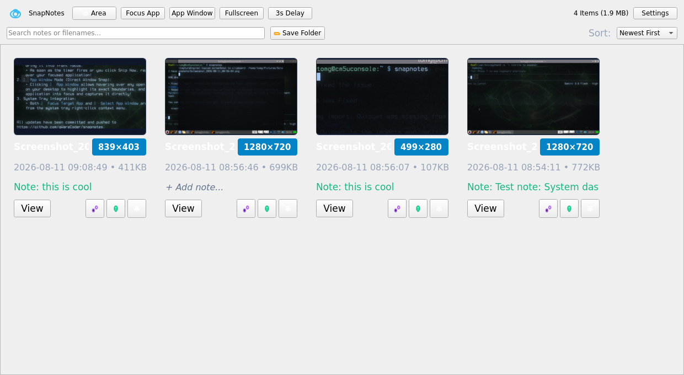
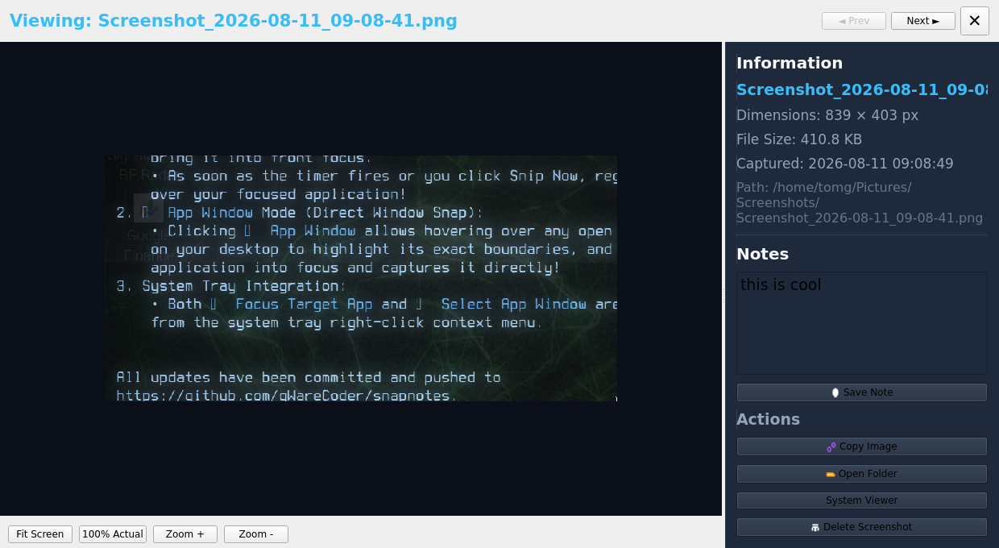
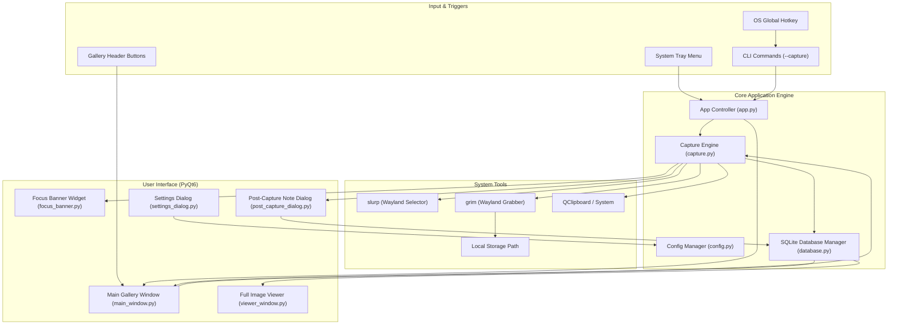

# SnapNotes 📸

> **Desktop Screen Capture, Searchable History & Note Manager for Linux**



**SnapNotes** is a modern, lightweight, feature-rich screen capture and snippet management application built for Linux desktops. It allows you to quickly take screenshots of selected screen regions or target application windows, specify custom storage locations, attach searchable text notes, browse high-resolution gallery histories, and operate seamlessly from your system tray.

---

## 🚀 Features

- **📸 Precision Area & Focus Application Capture**:
  - **`🎯 Focus Target App` Mode**: Minimizes SnapNotes and displays a floating focus banner (`ui/focus_banner.py`), giving you time to click on any application window (Browser, VS Code, Terminal) to bring it into front focus before capturing!
  - **`🪟 App Window` Mode**: Direct window selection powered by `slurp` — hover over any window to highlight its surface boundaries and click to snap it!
  - **`📸 Area` & Fullscreen**: Custom region selection or instant full desktop capture.
  - **`⏱️ Timer Delay`**: 3-second countdown timer for capturing open menus and dropdowns.
  - **Auto Copy**: Automatically copies captured screenshots to the system clipboard.

- **📁 Customizable Storage Location**:
  - Specify custom save paths (e.g. `~/Pictures/Screenshots` or any custom drive/directory).
  - Dynamic path selector with instant folder browsing via system file manager (`xdg-open`).

- **🖼️ Searchable History & Thumbnail Gallery**:
  - Grid view featuring high-quality cached thumbnail previews.
  - Resolution badges (e.g. `1280×720`), file sizes, and timestamps.
  - **Real-Time Search**: Instant filtering by note content, file names, or dates.
  - **Sorting**: Sort history by Newest First, Oldest First, Largest Size, or Smallest Size.

- **🔍 Full-Resolution Viewer with Pan & Zoom**:
  - Click any thumbnail to view the actual full-resolution screenshot.
  - **Pan & Zoom**: Interactive mouse wheel zoom, fit-to-screen, and 100% actual size toggle.
  - **Metadata & Controls**: View resolution, file size, storage path, edit notes live, or copy to clipboard.

- **📝 Note-Taking & Annotations**:
  - Optional **Post-Capture Popup** for writing notes immediately after capture.
  - Edit or view notes anytime from the gallery cards or detail view.
  - All notes are saved to an SQLite database and indexed for search.

- **🗑️ Safe File & Record Deletion**:
  - Single-click delete removes both the database metadata record and the image file from disk after user confirmation.

- **📥 System Tray Integration**:
  - Runs in the background with a system tray icon (`QSystemTrayIcon`).
  - Right-click tray menu for quick capture shortcuts (`📸 Area`, `🎯 Focus App`, `🪟 App Window`), opening gallery, save path options, or quitting.
  - Left-click tray icon toggles the history window.

---

## 📸 Screenshots

| History Gallery View | Full Resolution Viewer & Note Editor |
| :---: | :---: |
|  |  |

---

## 🏗️ Architecture

SnapNotes follows a clean, modular Model-View-Controller (MVC) architecture with persistent SQLite metadata storage and async capture handlers.



---

## 🛠️ Prerequisites & Installation

### 1. Install Dependencies (Debian / Ubuntu / Raspberry Pi OS)

```bash
sudo apt update
sudo apt install -y python3-pyqt6 python3-pil grim slurp
```

### 2. Clone & Setup Repository

```bash
git clone https://github.com/gwarecoder/snapnotes.git
cd snapnotes
```

### 3. Install Executable Launcher

```bash
mkdir -p ~/.local/bin ~/.local/share/applications

# Create wrapper script
cat << 'EOF' > ~/.local/bin/snapnotes
#!/bin/bash
export QT_QPA_PLATFORM=xcb
exec /usr/bin/python3 /home/tomg/snapnotes/main.py "$@"
EOF

chmod +x ~/.local/bin/snapnotes
```

---

## 🖥️ Usage & Command Line Interface

Launch SnapNotes directly from your app menu or terminal:

```bash
# Open Main History Gallery Window
snapnotes

# Start Minimized to System Tray
snapnotes --tray

# Trigger Immediate Area Capture
snapnotes --capture

# Trigger Immediate Fullscreen Capture
snapnotes --fullscreen
```

---

## ⚙️ Configuration & Data Storage

- **Configuration File**: `~/.config/snapnotes/config.json`
- **Database File**: `~/.config/snapnotes/snapnotes.db`
- **Thumbnail Cache**: `~/.cache/snapnotes/thumbnails/`
- **Default Screenshot Directory**: `~/Pictures/Screenshots/`

---

## 📄 License

MIT License. Developed for Linux desktops by [gwarecoder](https://github.com/gwarecoder).
